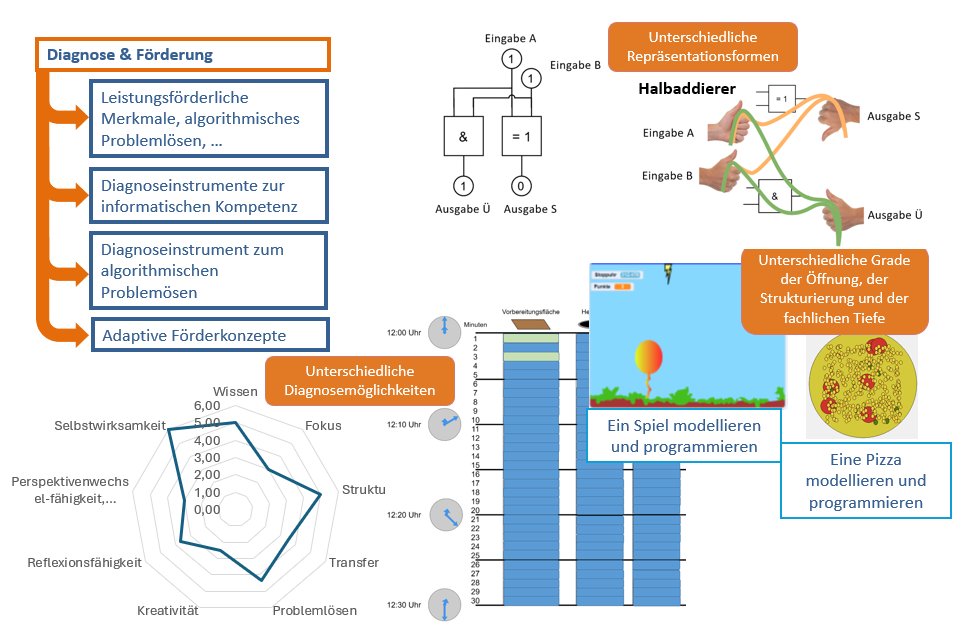

# LemaS-Transfer
LemaS-Transfer zielt auf die Vertiefung und weitere Verbreitung der Ergebnisse aus der ersten Förderphase des Forschungs- und Schulentwicklungsprojekts ab. Schulen, die bereits in der 1. Phase mit dem Forschungsverbund zusammengearbeitet haben, werden in der Transferphase zu Multiplikatorinnen und Multiplikatoren. In Schulnetzwerken treffen sie auf neue Schulen, denen sie die Anwendung der LemaS-P³rodukte näherbringen und mit denen sie ihre Erfahrungen und Best-Practice Beispiele zur Förderung von Potenzialen und Stärken der Schülerinnen und Schüler teilen. Der Forschungsverbund LemaS-Transfer begleitet die Schulen bei dieser Aufgabe mit vielfältigen Professionalisierungs- und Unterstützungsangeboten und beforscht zugleich die Transfer- und Implementationsprozesse. Um bestmögliche Bedingungen für einen erfolgreichen Transfer im Fach Informatik zu erreichen, bieten wir modularisierte Fortbildungseinheiten an. Die Fortbildungseinheiten sollen die Teilnehmenden befähigen, leistungsstarke und potenziell besonders leistungsfähige Schüler:innen in der Informatik zu erkennen und mithilfe eines potenzial- und begabungsförderlichen Informatikunterricht zu fördern.

# Ziele
Ziel unserer Fortbildungseinheiten ist zunächst der Aufbau eines gemeinsamen Verständnisses von informatischer Leistungsstärke verbunden mit der Erprobung und dem Einsatz informatischer Diagnoseinstrumente. Wir möchten zusammen die LemaS-Produkte ausprobieren, reflektieren und damit für einen potenzial- und begabungsfördernden Informatikunterricht begeistern. Wir begleiten Sie auf Ihrem persönlichen Weg zum/zur LemaS-Multiplikator:in.

# Programm/Durchführung
Im Verlauf der Veranstaltungsreihe werden zentrale Modulbausteine durchlaufen, die teilweise in virtuellen Formaten und teilweise in Präsenz stattfinden. Die Einführung in die theoretischen Grundlagen, um prozess- und inhaltsbezogenes Erkennen (Diagnostizieren) von Stärken und Schwächen und entsprechendes Fördern der Schüler:innen durchzuführen, erfolgt im Wechsel zwischen Theorie und Praxisphasen. Theoretische Grundlagen werden an praktischen Beispielen veranschaulicht und erprobt. Der sich anschließende Baustein enthält die Einführung in die praktische Anwendung des Diagnose- und Fördermaterials. Im letzten Baustein geht es darum, dass die Teilnehmenden befähigt werden, adaptive Diagnose- und Fördermaterialien für den eigenen Informatikunterricht zu entwickeln, zu evaluieren und den Bedürfnissen entsprechend weiterzuentwickeln. Um das Programm abzurunden und für alle Teilnehmenden noch nutzbrinender zugestalten, bieten wir regelmäßig ein monatliches digitales Austauschformat an. Bei diesen Treffen werden Themen und Schwerpunkte, die nicht oder nur unzureichend in der Einheit erörtet werden konnten, aufgegriffen. Auch eine engmaschigere Begleitung im Kontext des Einsatzes der Materialien oder der Umsetzung der Konzepte im Unterrichtsalltag könnte hier einen Platz finden.

# Kontakt
[Prof. Dr. Claudia Hildebrandt](https://www.ph-heidelberg.de/informatik/team/hildebrandt/)

[Matthias Matzner](https://www.ph-heidelberg.de/informatik/team/matzner/)

# Links
[Projektlink LemaS-Transfer](https://lemas-forschung.de/)

